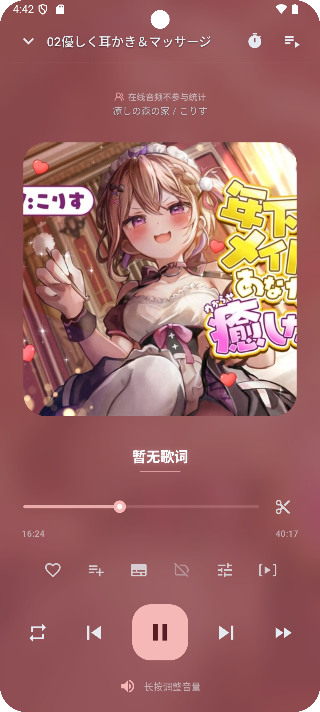
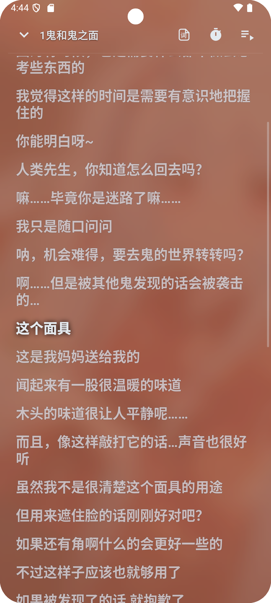
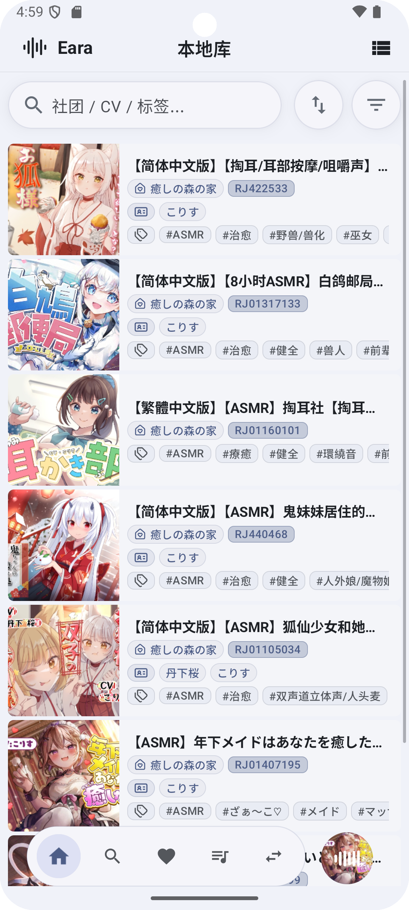
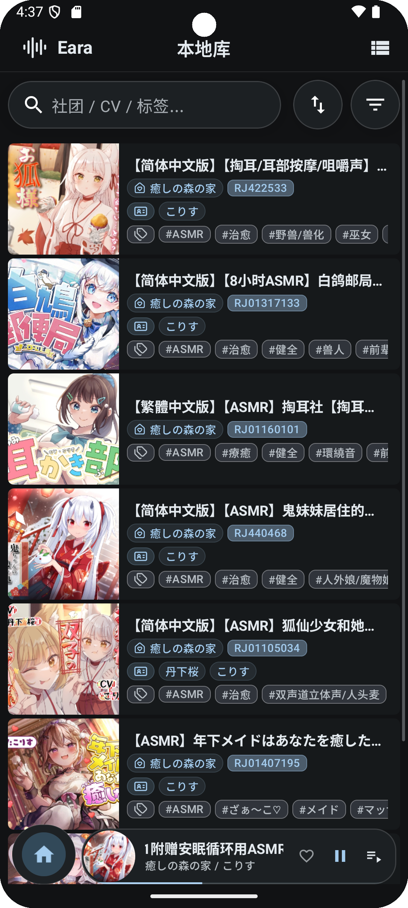
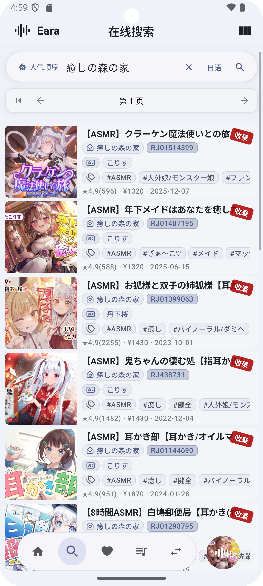
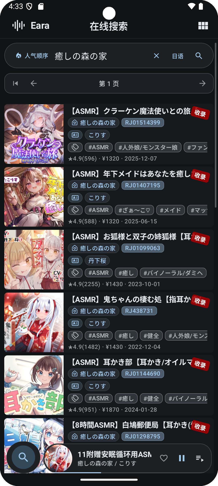
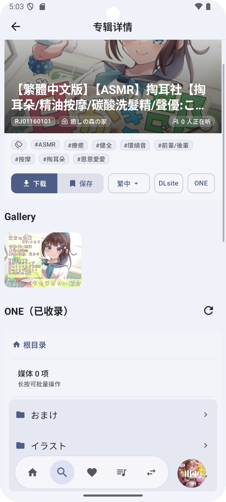
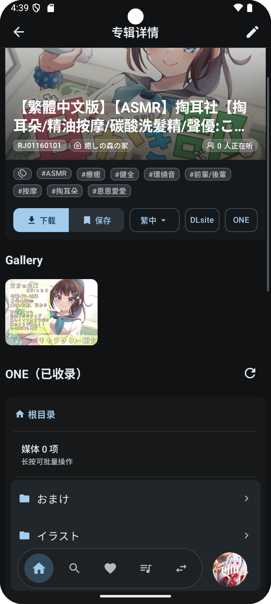
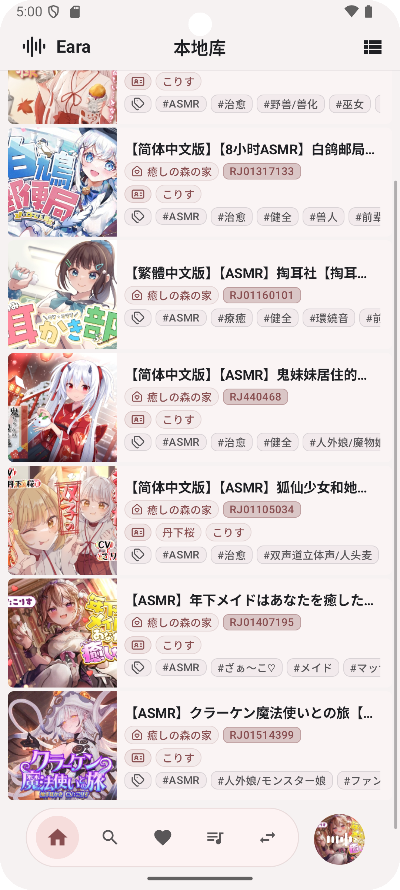
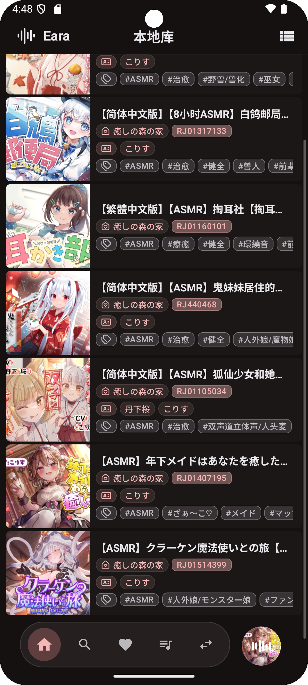

# EaraAsmrPlayer (Android)

  

> **THIS REPOSITORY AND ITS CONTENT WERE GENERATED 100% BY AI.**

## Overview

**EaraAsmrPlayer** 是一款专为 ASMR 内容打造的现代 Android 音频播放器。基于 **Jetpack Compose** 和 **Media3** 构建，提供沉浸式的本地音频管理与在线资源发现体验，支持歌词同步、音频效果调节、A–B 循环切片等核心特性。

---

## Sample Screens

### 沉浸式播放

| 沉浸式播放页面 | 字幕格式自动识别 |
|:---:|:---:|
|  |  |

### 本地管理

| 浅色主题 | 暗色主题 |
|:---:|:---:|
|  |  |

### 在线搜索

| 浅色主题 | 暗色主题 |
|:---:|:---:|
|  |  |

### 在线播放

| 浅色主题 | 暗色主题 |
|:---:|:---:|
|  |  |

### 主题色自动取色（莫奈取色）

| 浅色主题 | 暗色主题 |
|:---:|:---:|
|  |  |

---

## Features

- 基于 Media3 (ExoPlayer) 的高保真音频播放
- Jetpack Compose + Material 3 构建的现代 UI
- 本地音轨库管理：专辑/音轨视图、网格/列表切换、快速筛选与搜索
- 播放列表与收藏夹，支持分组整理
- 同步歌词（LRC/VTT/SRT），支持悬浮歌词覆盖层
- 耳机音频效果：均衡器、混响、增益、虚拟环绕、左右声道平衡、空间化
- 双声道频谱可视化，专为双耳音频内容优化
- 切片标记与 A–B 循环：在进度条上标记片段，拖拽微调、预览切片
- 后台下载与离线持久化
- 内置在线源：DLsite（Play 曲库）、asmr.one
- 视频播放支持常见格式及 m3u8 流
- 睡眠定时器与通知栏后台播放控制

---

## Downloads

从 **GitHub Releases** 下载最新版本（tag `v*`，目前最新：`v1.1.0`）。

---

## Content Sources（内置）

- **DLsite（抓取）**
- **DLsite Play 曲库**
- **asmr.one API**

请负责任地使用，遵守适用的法律及服务条款。

---

## Disclaimer

- 本项目**非官方产品**，与任何平台、商店或品牌无关。
- 代码可能包含 **Bug、未完成实现或安全问题**。用于生产环境前请仔细审查。
- 你须自行确保遵守所有适用的第三方服务法律及条款。
- **不提供任何保证**，使用风险自负。

---

## AI Generation Notice

本仓库（包括文档和代码变更）标注为 **100% AI 生成**。强烈建议进行人工审查。
